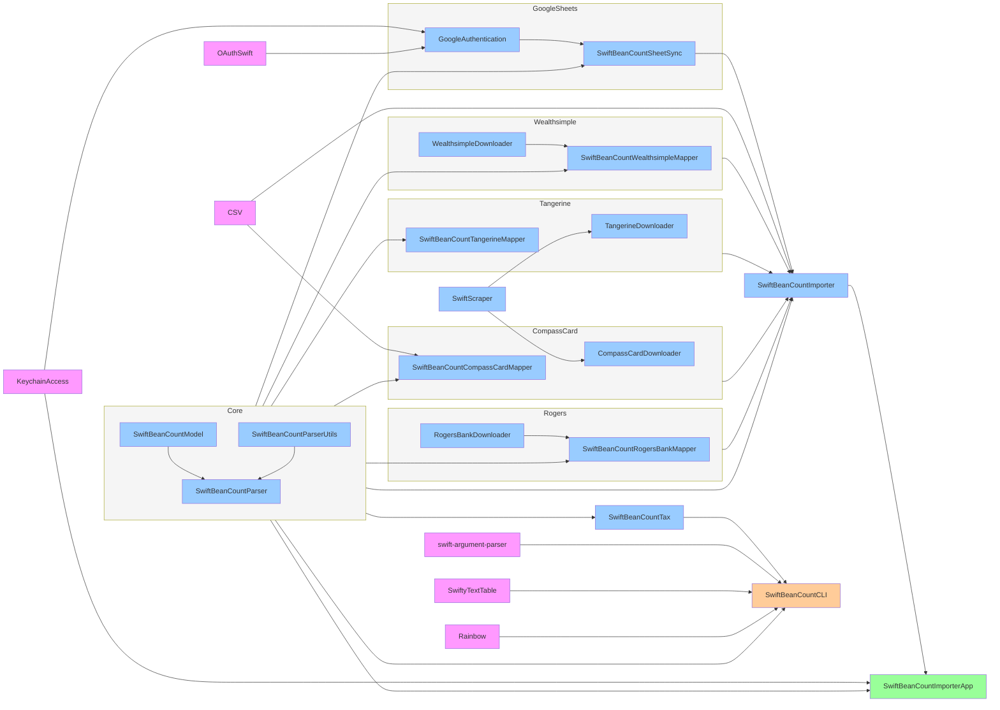
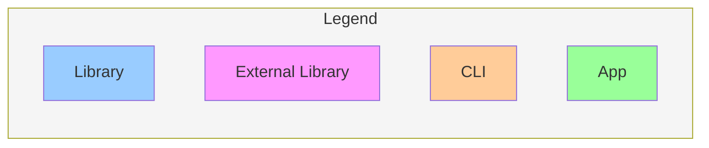

# SwiftBeanCount: Plain-Text Double-Entry Accounting in Swift

This is the main repository of SwiftBeanCount. It does not contain any code, but only documentation.

## What

SwiftBeanCount is a double-entry accounting software written in Swift. It is inspired by [beancount](https://github.com/beancount/beancount) (hence the name) and therefore reads and writes [plain text accounting](http://plaintextaccounting.org) files.

## Why

Beancount is an amazing project and I am an active user of it. I'd recommend it to everybody who is good in the commandline and wants to take control of their finances. My aim is not to create a competitor. I started this project and continue to work on it in my spare time for different reasons:

  - Learn, practice and keep up to date with Swift
  - Learn SwiftUI
  - Do some native MacOS developement (normally I focus on iOS)
  - Gain experience in GitHub Actions
  - Practice TDD

## Goal

As metioned above my goal is not to create a competitor to beancount. Beancount is used by a lot of people and has proven itself over years, while this project is the hobby of a single person.

The goal is to supplement my usage of beancount and [fava](https://github.com/beancount/fava). As it operates on plain text files, you can use them in beancount and SwiftBeanCount, perfoming operations in which tool better fits your needs, switching as often as you like. Therefore I aim to keep the syntax of SwiftBeanCount mostly a subset of the syntax beancount uses (read more about this below).

## How

The project is split across several repositories, please consult their readmes to get more instructions:

### Apps

Apps with a user interface:

* [SwiftBeanCountImporterApp](https://github.com/Nef10/SwiftBeanCountImporterApp): App to import CSV files and texts from banks websites, as well as download data directly from there, and return the user transactions to add to their ledger
* [SwiftBeanCountCLI](https://github.com/Nef10/SwiftBeanCountCLI): CLI tool for basic operations on the ledger
* [SwiftBeanCountApp](https://github.com/Nef10/SwiftBeanCountApp): GUI tool for basic operations on the ledger

### Libraries

The code is split up in several internal libraries, which allows functionality to be re-used across different apps:

* [SwiftBeanCountModel](https://github.com/Nef10/SwiftBeanCountModel): Model which holds all data as well as the logic
* [SwiftBeanCountParser](https://github.com/Nef10/SwiftBeanCountParser): Parser which reads the plain text and transforms it into an instance of the model
* [SwiftBeanCountParserUtils](https://github.com/Nef10/SwiftBeanCountParserUtils): Utility functions for parsing, which are shared by the parser and some importers / mappers
* [SwiftBeanCountImporter](https://github.com/Nef10/SwiftBeanCountImporter): Library to read CSV files and texts (e.g. from banks) and transform them into transactions
* [SwiftBeanCountTax](https://github.com/Nef10/SwiftBeanCountTax): Library to help calculate tax related values from your ledger
* [SwiftBeanCountSheetSync](https://github.com/Nef10/SwiftBeanCountSheetSync): Library to sync transaction between a Google Sheet and a ledger
* [GoogleAuthentication](https://github.com/Nef10/GoogleAuthentication): Library to help authenticate to Google APIs
* [WealthsimpleDownloader](https://github.com/Nef10/WealthsimpleDownloader): Library to download data from Wealthsimple
* [SwiftBeanCountWealthsimpleMapper](https://github.com/Nef10/SwiftBeanCountWealthsimpleMapper): Library to convert downloaded data from Wealthsimple
* [RogersBankDownloader](https://github.com/Nef10/RogersBankDownloader): Library to download data from Rogers Bank
* [SwiftBeanCountRogersBankMapper](https://github.com/Nef10/SwiftBeanCountRogersBankMapper): Library to convert downloaded data from Rogers Bank
* [TangerineDownloader](https://github.com/Nef10/TangerineDownloader): Library to download data from Tangerine
* [SwiftBeanCountTangerineMapper](https://github.com/Nef10/SwiftBeanCountTangerineMapper): Library to convert downloaded data from Tangerine
* [CompassCardDownloader](https://github.com/Nef10/CompassCardDownloader): Library to download data from the CompassCard website
* [SwiftBeanCountCompassCardMapper](https://github.com/Nef10/SwiftBeanCountCompassCardMapper): Library to convert downloaded data from the CompassCard website

### Dependency Diagram

A simplified diagram of the package dependencies:

##  Status

This project is in an alpha stage, please do not use unless you are open to experiment or contribute.

## Comparasion to beancount

### Syntax

#### Syntax beancount supports but SwiftBeanCount does not

*If you want to use SwiftBeanCount please make sure your ledger file does not include any of this:*

  - Date with slashes instead of dashes
  - "txn" instead of * as ok flag
  - Flags on Postings
  - An optional pipe between payee and narration
  - Leave out payee / narration field
  - Amount Interpolation ([Ticket](https://github.com/Nef10/SwiftBeanCountParser/issues/23))
  - Inline math
  - Links
  - Pad ([Ticket](https://github.com/Nef10/SwiftBeanCountParser/issues/30))
  - Documents ([Ticket](https://github.com/Nef10/SwiftBeanCountModel/issues/49))
  - Options ([Ticket](https://github.com/Nef10/SwiftBeanCountModel/issues/47))
  - Notes ([Ticket](https://github.com/Nef10/SwiftBeanCountModel/issues/48))
  - Includes
  - Plugins
  - Tag stacks ([Ticket](https://github.com/Nef10/SwiftBeanCountParser/issues/29))
  - Balance checks on parent accounts
  - Accounts with more than one defined commodity
  - Lines with unrecognizable input (will output warning in SwiftBeanCount)

#### Syntax SwiftBeanCount supports but beancount does not

*If you use this synax please note that your file will probably stop working in beancount. Threrefore I strongly recommend against using any of this:*

  - Full unicode support
  - Commodities with more than 24 characters

### Other differences

* SwiftBeanCounts parsing is not (yet) optimized and therefore slow
* SwiftBeanCount count only support percision which without decimal point fits into UInt64 (should not be a problem in the real world)

## Contributing

Contributions in form of bug reports or pull requests are very welcome!

# Copyright

While my code is licensed under the [MIT License](https://github.com/Nef10/SwiftBeanCount/blob/main/LICENSE), the source repository may include names or other trademarks of TransLink, CompassCard, Rogers, Rogers Bank, Tangerine, Scotiabank, Wealthsimple, RBC, N26, Google, EquatePlus, flatexDEGIRO Bank, Simplii or other entities; potential usage restrictions for these elements still apply and are not touched by the software license. Same applies for the API design. I am in no way affiliated with them other than being customer.
